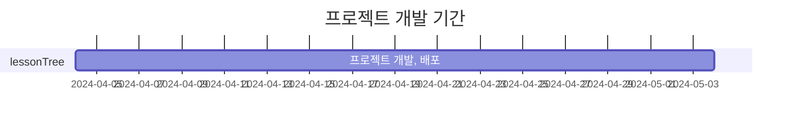

# 🌲<span style="font-size:40px">과외나무</span> < Private Lesson Web Platform >
[🔗 과외나무 바로가기](http://react-lessontree.s3-website.ap-northeast-2.amazonaws.com/)<br>
[🔗 API 명세서 바로가기](https://supreme-price-d63.notion.site/4f5dcd1c7569434c9db602ef2b2656d0?v=c4a2bf31de214552a2b227ffb07aa61c&pvs=4)

## 📍목차
1.[ 프로젝트 소개](#-프로젝트-소개)<br>
2.[ 주요기능](#-주요기능)<br>
3.[ 기획 의도](#-왜-이-프로젝트를-기획했나요)<br>
4.[ 프로젝트를 통해 배운점](#-이-프로젝트를-통해-무엇을-배우셨나요)<br>
5.[ 개발 기간](#-프로젝트-개발-기간)<br>
6.[ 팀 소개](#-팀-소개)<br>
7.[ 역할 분담](#️-역할-분담)<br>
8.[ API명세서](#-api-명세서-바로가기)<br>
9.[ 개발 환경](#️-개발-환경)<br>
10.[ pom.xml](#️-pomxml)<br>
11.[ node modules](#️-node-modules)<br>
12.[ 협업방식](#-협업-방식)<br>
13.[ 프로젝트 진행상황 관리](#-프로젝트-진행-상황-관리)<br>
14.[ branch 전략](#-브랜치-전략)<br>
15.[ github flow 전략](#-github-flow-전략)<br>
16.[ github action](#-github-action---브랜치-생성-자동화)<br>
17.[ 컨벤션](#-컨벤션)<br>
18.[ 커밋 컨벤션](#-커밋-컨벤션)<br>
19.[ 페이지 미리보기](#페이지-미리보기)<br>

##  🍀프로젝트 소개

- 과외나무는 선생님과 학생의 과외를 연결시키는데 도움을 주는 웹 서비스 입니다.
- 사용자들 간의 공부(학습)정보를 공유할 수 있는 공간을 마련했습니다.
- 웹 서비스 특성 상 개인정보가 많이 들어가있어 보안을 신경썼으며 이메일 인증 절차를 통해 신뢰를 높였습니다.
- 학생들은 필요한 수업을 업로드하여 과외를 구할 수 있습니다.
- 선생님들은 프로필을 관리하고 학생에게 메일로 프로필을 보내 홍보 할 수 있습니다.
- 학생들의 과외 신청을 메일을 통해 신청 할 수 있습니다.

## 🌱 주요기능
- 학생은 자신이 원하는 과목을 가르치는 선생님에게 공고 메일을 보내 과외 신청할 수 있습니다
- 선생님은 학생에게 프로필을 메일로 보내 과외 신청을 할 수 있습니다.
- 학생 커뮤니티, 선생님 커뮤니티 그리고 공용 커뮤니티를 만들어 자유롭게 정보공유를 할수있습니다. 

<br>

## 🧐 왜 이 프로젝트를 기획했나요?
- 많은 전문지식 또는 전문기술을 가진 사람들과 그러한 것을 배우고 싶어하는 사람들이 있습니다. 이러한 수요자와 공급자들을 위한 웹 플랫폼을 초기 주제로 정했습니다.<br>그중 사교육이 활발한 우리나라 특성을 생각해 과외라는 특징을 살려 프로젝트를 기획하게되었습니다.
- 초기 기획안이었던 매칭이라는 아이디어를 적극 활용했습니다.
- 실제 구현 및 사용 가능한 기능 및 서비스 제작했습니다.

<br>

## 🎓 이 프로젝트를 통해 무엇을 배우셨나요?
### 🐖전주환
1. 첫번째, 팀 프로젝트를 진행하면서 협업과 커뮤니케이션의 중요성을 깨닫게 되었습니다. 팀원 서로를 존중하고 포용하는 능력을 키울 수 있었고, <br>원활한 소통과 정보 공유를 통해 어려움을 함께 극복했으며 목표를 달성할 수 있었습니다.

2. 두번째, 보안에 대한 미숙한 지식 및 경험과 잦은 예상치 못한 예외 발생으로 난관에 부딪히는 경험을 했습니다. <br>이러한 상황에서 인터넷 검색 및 팀원들과의 정보공유 등으로 문제 해결 능력을 발휘하고 적절한 대응 방안을 모색하는 값진 경험을 쌓을 수 있었습니다.

3. 세번째, 프로젝트를 진행하면서 개인의 역할과 책임을 관리하고 시간을 효율적으로 관리하는 법을 배울 수 있었습니다. <br>이러한 경험을 통해 향후 개인 및 작업활동에서 유용하게 활용하게 될 것이라고 생각합니다.

### 🐉정건희
1. 프로젝트 중 소통이 가장 중요하다는 사실을 알았습니다. 더 자주 소통하고 자주 의견을 나누는 방법이 더 효율적인 기능을 만들고 <br>더 나은 방법들을 찾아준다는것이 이번 프로젝트를 통해 배운 가장 큰 것이라 생각됩니다.

### 🐅김도균


<p align="right"><a href="#top">TOP 🔼</a></p>

<br>

## ⏳ 프로젝트 개발 기간


<br>

## 🌈 팀 소개

|&emsp;<span style="font-size:16px">🐉정건희(팀장)</span>&emsp;&emsp;&emsp;&emsp;&emsp;|<span style="font-size:16px">🐖전주환</span>&emsp;&emsp;&emsp;&emsp;&emsp;&emsp;&emsp;&emsp;|<span style="font-size:16px">🐅김도균&emsp;&emsp;&emsp;&emsp;</span>|
|---|---|---|

<a href="https://github.com/donasman" >
    
<a>&emsp;&emsp;
<a href="https://github.com/JeonJuhwanaaa" >
    
<a>&emsp;&emsp;
<a href="https://github.com/GyunNote" >
    
</a>


<p align="right"><a href="#top">TOP 🔼</a></p>

<br>


## 🙋‍♀️ 역할 분담

<center>

|<span style="font-size:30px">🐉정건희</span>|<span style="font-size:30px">🐖전주환</span>|<span style="font-size:30px">🐅김도균</span>|
|---|---|---|
|학생 공고 등록|역할(학생 / 선생님)에 따라 다른 회원가입|학생 커뮤니티 게시판 등록|
|학생 포스터 조회|회원가입 시 유효성 검사 및 중복검사|학생 커뮤니티 게시판 조회|
|학생 공고 리스트 조회|일반 로그인|학생 커뮤니티 게시판 삭제|
|학생 포스터 검색 필터|소셜(네이버, 카카오, 구글) 통합 회원가입 및 로그인|학생 커뮤니티 게시판 수정|
|선생님 필수정보 등록|로그인 및 회원가입 페이지 디자인|선생님 커뮤니티 게시판 등록|
|선생님 리스트 조회|이름과 이메일로 아이디 찾기 및 조회|선생님 커뮤니티 게시판 조회|
|선생님 프로필 조회|아이디와 이메일로 비밀번호 찾기 및 수정|선생님 커뮤니티 게시판 삭제|
|선생님 프로필 검색 필터|찾기 페이지 디자인|선생님 커뮤니티 게시판 수정|
|메인페이지 초기 디자인|Security 및 Token 발급|커뮤니티 디자인|
|학생 공고 리스트 페이지 디자인|선생님 필수정보 등록 등록|공지사항 게시판 CRUD|
|선생님 프로필 페이지 디자인|선생님 필수정보 등록 페이지 디자인|공부방 게시판 CRUD|
|선생님 프로필 리스트 페이지 디자인|선생님 프로필 조회|게시판 댓글 등록|
|마이페이지 디자인|선생님 프로필 조회 페이지 디자인|게시판 댓글 삭제|
|학생 -> 선생님 과외 신청 메일 보내기|선생님 프로필 수정 기능|게시판 페이지네이션 및 검색 기능|
|선생님 -> 학생 프로필 보내기|학생 공고 등록|게시판 유저 이미지 조회|
|메일 디자인|학생 프로필 조회|게시물 신고|
|DB 설계|학생 프로필 수정|게시물 신고페이지|
|관리자 페이지|로그아웃, 회원탈퇴, 메일보내기 등 모달 기능|게시물 조회수|
|신고 관리 기능 구축|페이지 풋 디자인|프로필 이미지 등록|
|회원 비활성화 및 활성화|최종 메인페이지 및 로고 디자인| |

</center>

### <span style="font-size:30px"> 🌎공통 작업</span>


<br>
<br>

## ⚙️ 개발 환경

<div>
  
  
</div>
<div>
  
  
  
   
  
</div>
<div>
  
</div>
<div>
  
  
  
  
</div>

<br>
<br>

### ⛓️ pom.xml
|모듈명|용도|
|-|-|
|lombok| 어노테이션으로 코드 자동 생성을 위해 사용 |
|jjwt-api / jjwt-impl / jjwt-jackson| JWT 활용을 위해 사용 |
|spring-boot-starter-mail | 이메일 인증 및 과외 신청, 프로필 홍보 기능 위해 사용 |
|spring-boot-starter-oauth2-client | oauth2 인증을 위해 사용 |
|spring-boot-starter-web | spring web 프로젝트에 필수적인 모듈 |
|mysql-connector-java | mysql 연결을 위해 사용 |
|spring-boot-starter-security | 스프링 시큐리티를 적용하기 위해 사용 |
|spring-boot-starter-aop | 스프링 aop를 적용하기 위해 사용 |
|mybatis-spring-boot-starter | mybatis를 적용하기 위해 사용 |
|spring-boot-starter-thymeleaf | 메일에 html 형식 파일을 보내기 위해 사용 |
|spring-boot-devtools | 빠른 재시작을 위해 사용 |

<br>

### ⛓️ node modules
|모듈명|용도|
|-|-|
|react-router-dom / react-dom / router|페이지 라우팅을 위해 사용|
|axios|서버와 통신을 위해 사용|
|styled-reset| 스타일 구현의 편의를 위해 사용 |
|@emotion/react / @emotion/styled| 쉬운 css 적용을 위해 사용 |
|@types/react-modal / react-modal| 모달을 구현하기 위해 사용 |
|firebase| 이미지 업로드를 위해 사용 |
|react / react-scripts| 리액트를 적용하기 위해 사용 |
|react-icons| 리액트 아이콘을 적용하기 위해 사용 |
|react-query| 데이터 Fetching, Caching, 동기화, 서버 데이터 업데이트 등을 쉽게 하기 위해 사용 |
|react-quill| 텍스트 에디터를 적용하기 위해 사용 |
|react-select| select 요소를 쉽게 쓰기 위해 사용 |

<p align="right"><a href="#top">TOP 🔼</a></p>
<br>

## <a>🤝 협업 방식</a>

1. 엑셀 파일 혹은 프로젝트 노션 페이지를 통해 남은 작업 목록에서 작업을 분담합니다.
    <a href=""> [Notion]</a>
2. 해당하는 업무에 대해 **GitHub Issue**를 생성합니다. (이슈 템플릿 사용)
3. GitHub Actions에 의해 자동으로 생성된 브랜치로 전환하여 해당하는 업무를 진행합니다.
4. 작업을 완료하면 작업한 브랜치에서(main브랜치 X) 코드를 push합니다.
5. **PR(Pull Request)** 을 오픈합니다.
- 코드 리뷰 & 승인은 생산성을 위해 팀장으로 지정하고, 각자가 맡은 부분에 대한 책임감을 가지고 프로젝트를 진행했습니다.

6. PR이 merge되어 close 되면 해당 이슈는 자동으로 Done상태로 변경됩니다.

<br>

## 🔀 브랜치 전략

### 👍 GitHub Flow 전략

- 프로젝트 기간 동안 팀원들이 같은 시간에 작업하기 때문에 잦은 충돌이 발생할 것을 우려하여 충돌의 크기를 줄이고자 기능별로 담당자를 정해 개발을 진행하였습니다.
- 기본적으로 master branch에 대한 규칙만 정확하게 정립되어 있다면 나머지 가지들에 대해서는 특별한 관여를 하지 않으며 pull request기능을 사용하도록 권장하였습니다.

<br>

### 🚀 GitHub Action - 브랜치 생성 자동화

- 이슈를 생성하면 GitHub Action으로 해당 이슈에 해당하는 브랜치가 자동으로 생성되도록 설정하여 브랜치명을 고민하고 브랜치를 생성하는 시간을 줄였습니다.
- 예) 자동 생성된 브랜치를 pull 하고 ```git fetch ```한뒤 ```git checkout feed좋아요중복방지-#242```하여 해당 브랜치로 이동합니다.
- [브랜치 history] <a href="">백앤드 브랜치 히스토리</a>

<p align="right"><a href="#top">TOP 🔼</a></p>
<br>

## 📐 컨벤션

팀원 간의 원활한 소통과 협업을 위해 커밋 컨벤션과, 코드 컨벤션을 만들어 이를 따랐습니다.
리드미에는 간략히 작성하고, 자세한 컨벤션은 각각의 타이틀에 링크된 깃허브 위키에 적어두었습니다.


### [🔗 커밋 컨벤션](https://www.notion.so/Git-Commit-Message-Convention-569511dc005141dd80a03a43bdb1fc7d)

- 깃 커밋 컨벤션을 참고하여 회의를 통해 프로젝트에서 사용할 컨벤션을 지정했습니다.

    ```
    1. 커밋 유형 지정
        - 커밋 유형은 영어 대문자로 작성하기
        - 커밋 유형
        - Feat : 새로운 기능 추가
        - Fix : 버그 수정
        - Docs : 문서 수정
        - Style : 코드 formatting, 세미콜론 누락, 코드 자체의 변경이 없는 경우
        - Refactor : 코드 리팩토링
        - Test : 테스트 코드, 리팩토링 테스트 코드 추가
        - Chore : 패키지 매니저 수정, 그 외 기타 수정 ex) .gitignore
        - Design : CSS 등 사용자 UI 디자인 변경
        - Comment : 필요한 주석 추가 및 변경
        - Rename : 파일 또는 폴더 명을 수정하거나 옮기는 작업만인 경우
        - Remove : 파일을 삭제하는 작업만 수행한 경우
        - !BREAKING CHANGE : 커다란 API 변경의 경우
        - !HOTFIX : 급하게 치명적인 버그를 고쳐야 하는 경우

    🧾 2. 제목과 본문을 빈행으로 분리
            - 커밋 유형 이후 제목과 본문은 한글로 작성하여 내용이 잘 전달될 수 있도록 할 것
            - 본문에는 변경한 내용과 이유 설명 (어떻게보다는 무엇 & 왜를 설명)

    ↩️ 3. 제목은 영문 기준 50자 이내로 할 것

    ⏺️ 4. 자신의 코드가 직관적으로 바로 파악할 수 있다고 생각하지 말자

    ```

<br>

## 페이지 미리보기


<div align="center">
    <div>
        <b>비로그인 커뮤니티 이용</b>
    </div>
    <p align="center">
        
    </p>
    <br>
</div>

<div align="center">
    <div>
        <b>회원가입</b>
    </div>
    <p align="center">
        
    </p>
    <br>
</div>

<div align="center">
    <div>
        <b>소셜 회원가입</b>
    </div>
    <p align="center">
        
    </p>
    <br>
</div>

<div align="center">
    <div>
        <b>소셜 계정 통합</b>
    </div>
    <p align="center">
        
    </p>
    <br>
</div>

<div align="center">
    <div>
        <b>소셜 통합 로그인</b>
    </div>
    <p align="center">
        
    </p>
    <br>
</div>

<div align="center">
    <div>
        <b>로그인</b>
    </div>
    <p align="center">
        
    </p>
    <br>
</div>

<div align="center">
    <div>
        <b>아이디 찾기</b>
    </div>
    <p align="center">
        
    </p>
    <br>
</div>

<div align="center">
    <div>
        <b>비밀번호 찾기</b>
    </div>
    <p align="center">
        
    </p>
    <br>
</div>


<div align="center">
    <div>
        <b>로그아웃</b>
    </div>
    <p align="center">
        
    </p>
    <br>
</div>

<div align="center">
    <div>
        <div><b>학생 - 메인페이지</b></div>
    </div>
    <p align="center">
        
    </p>
    <br>
</div>

<div align="center">
    <div>
        <div><b>선생님 - 메인페이지</b></div>
    </div>
    <p align="center">
        
    </p>
    <br>
</div>

<div align="center">
    <div>
        <b>선생님 - MyPage</b>
    </div>
    <p align="center">
        
    </p>
    <br>
</div>

<div align="center">
    <div>
        <b>선생님 - 쓴 글 확인</b>
    </div>
    <p align="center">
        
    </p>
    <br>
</div>

<div align="center">
    <div>
        <b>선생님 - 프로필 관리 및 정보수정</b>
    </div>
    <p align="center">
        
    </p>
    <br>
</div>

<div align="center">
    <div>
        <b>선생님 - 프로필사진 등록</b>
    </div>
    <p align="center">
        
    </p>
    <br>
</div>

<div align="center">
    <div>
        <b>선생님 - 커뮤니티 검색 기능</b>
    </div>
    <p align="center">
        
    </p>
    <br>
</div>

<div align="center">
    <div>
        <b>선생님 - 과외학생 검색필터로 찾기</b>
    </div>
    <p align="center">
        
    </p>
    <br>
</div>

<div align="center">
    <div>
        <b>선생님 - 커뮤니티 게시물 작성</b>
    </div>
    <p align="center">
        
    </p>
    <br>
</div>

<div align="center">
    <div>
        <b>선생님 - 커뮤니티 게시물 수정</b>
    </div>
    <p align="center">
        
    </p>
    <br>
</div>

<div align="center">
    <div>
        <b>선생님 - 커뮤니티 게시물 삭제</b>
    </div>
    <p align="center">
        
    </p>
    <br>
</div>

<div align="center">
    <div>
        <b>선생님 - 댓글 등록 및 수정</b>
    </div>
    <p align="center">
        
    </p>
    <br>
</div>

<div align="center">
    <div>
        <b>선생님 - 댓글 삭제</b>
    </div>
    <p align="center">
        
    </p>
    <br>
</div>

<div align="center">
    <div>
        <b>게시물 신고</b>
    </div>
    <p align="center">
        
    </p>
    <br>
</div>

<div align="center">
    <div>
        <b>댓글 수정</b>
    </div>
    <p align="center">
        
    </p>
    <br>
</div>

<div align="center">
    <div>
        <b>댓글 신고</b>
    </div>
    <p align="center">
        
    </p>
    <br>
</div>

<div align="center">
    <div>
        <b>유저 신고</b>
    </div>
    <p align="center">
        
    </p>
    <br>
</div>


<div align="center">
    <div>
        <b>관리자 - 게시글 삭제</b>
    </div>
    <p align="center">
        
    </p>
    <br>
</div>

<div align="center">
    <div>
        <b>관리자 - 신고페이지 확인 후 해당 댓글 삭제</b>
    </div>
    <p align="center">
        
    </p>
    <br>
</div>

<div align="center">
    <div>
        <b>관리자 - 신고받은 유저 확인 후 해당 유저 계정 비활성화</b>
    </div>
    <p align="center">
        
    </p>
    <br>
</div>

<p align="right"><a href="#top">TOP 🔼</a></p>


## 로컬 환경에서 프로젝트 구동 - 백엔드

- 레포지토리 클론
```
git clone 
```
- 프로젝트 소스 코드 폴더로 이동
```
cd my-app
```
- maven 빌드 진행
```
./mvnw clean package -Dtestskip
```
- 백그라운드에서 실행
```
nohup java -jar ~.jar &
```

## 로컬 환경에서 프로젝트 구동 - 프론트

- 레포지토리 클론
```
git clone 
```
- 프로젝트 소스 코드 폴더로 이동
```
cd my-app
```
- 필요한 모듈 설치
```
npm install
```
- 로컬 환경에서 리액트 앱을 실행
```
npm start
```

<p align="right"><a href="#top">TOP 🔼</a></p>

